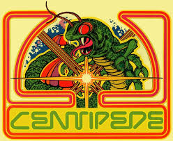
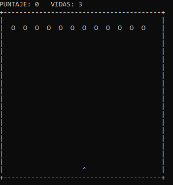

[](https://classroom.github.com/a/mi1WNrHU)
# 👾 Proyecto de C++ - Centipede



## 📑 Descripción del Proyecto

**Temática y ambientación:**
El entorno podría decirse que representa un jardín en el que emerge un centipede de la parte superior y baja hacia el jugador.

**Mecánica principal:**
El juego consiste en disparar a la cabeza del centipede para ganar, moviendote usando las flechas de dirección para calcular tus tiros.

**Idea general de la jugabilidad:**


En arcade se usa trackball, lo que permite un movimiento suave y preciso, en cambio en el ordenador ocupas las flechas direccionales. 

Solo puedes tener un solo disparo en pantalla a la vez, lo que añade cierta dificultad.

Tienes 3 vidas, el centipede se mueve hacia abajo hasta llegar al shooter del jugador, para vencerlo tienes que disparale en la cabeza, de lo contario, perderás.

## ⚙ Aplicación de los temas vistos

**Variables y tipos de datos**: 

Se ocuparon variables del tipo `int` para las vidas y el puntaje.

Ejemplo:


`int score = 0;`

`int lives = 3;`

También tipo `char` para obtener la tecla presionada por el usuario.

Ejemplo:

`char tecla = 0;`

**Uso de If, else**:

Ejemplo:

Un ejemplo de la aplicación del if, else es en el menú del juego, en el que se le pregunta al usuario si quiere jugar o salir del juego.


**Uso del bucle for**:

Ejemplo: 

Se aplicó este tipo de bucle para mover al centipede cuando choca con el borde. A continuación se muestra un fragmento del código que cumple la función.


**Uso del bucle while**:

Ejemplo:

Se utliza en main para controlar el juego.


**Uso de Funciones**:

Ejemplo: Se usó una función tipo void para comenzar el juego.


## Ejecución

## Consideraciones técnicas


## Mockups





## 🕹 Equipo

- **Nombre del equipo:** Code_Warriors.cpp

### 👥Integrantes del equipo

1. **Nombre completo:** Milton Guillermo Rivas Palacios  
   **Carnet:** 00019725

2. **Nombre completo:** David Armando Romero Siliezer  
   **Carnet:** 00203725

3. **Nombre completo:** Diego Alejandro Tolentino  
   **Carnet:** 00128925

4. **Nombre completo:** Josué Miguel Peña Torres  
   **Carnet:** 00014425

## Instrucciones de Ejecución

1. Clona este repositorio en tu máquina local:
   ```bash
   git clone https://github.com/FDP-01-2025/project-404-not-found

