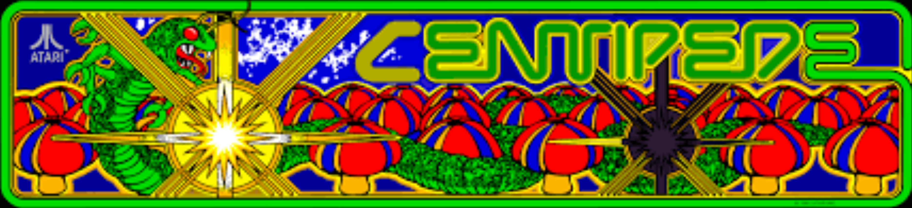
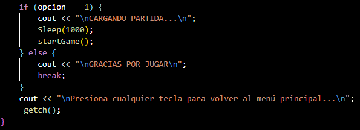
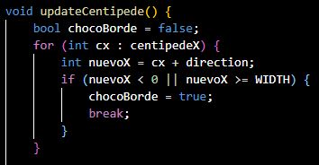
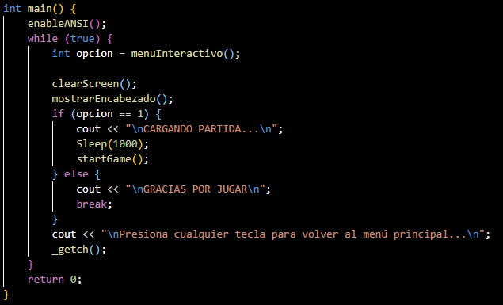
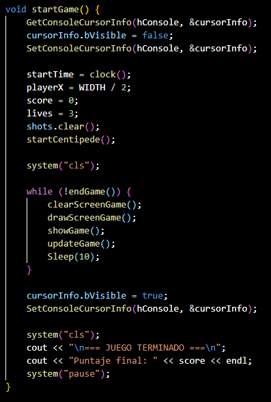
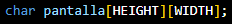
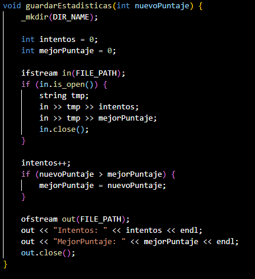
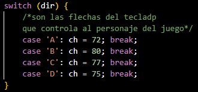
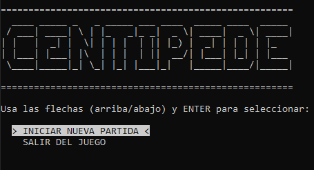
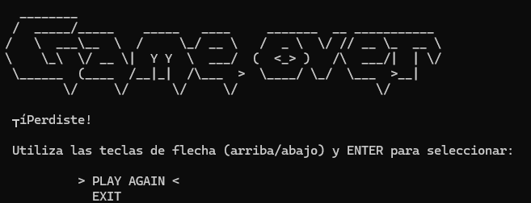

[](https://classroom.github.com/a/mi1WNrHU)
# 👾 Proyecto de C++ - Centipede



## 📑 Descripción del Proyecto

**Temática y ambientación:**

El entorno podría decirse que representa un jardín en el que emerge un centipede de la parte superior y baja hacia el jugador con  una forma amenzante, generando de esta forma una presión constante, creando en el usuario la sensacion que debe de actuar rápidamente, sino el ciempiés llegará a el y perderá una vida. 

**Mecánica principal:**

El juego consiste en el jugador controla una pequeña nave con un cañon en la parte inferior de la pantalla, este debe manipular esta, buscando disparar a la cabeza del centipede para ganar, moviendote usando las flechas de dirección para calcular tus tiros. Haciendo de esta forma que la clave del juego se convierta no solamente en disparar, sino calcular tus tiros para destruir al ciempiés lo antes posible. 


**Idea general de la jugabilidad:**

La jugabilidad se base en el clasico sistema de un arcade en donde se usa trackball, lo que permite un movimiento suave y preciso, en cambio en la adaptacion que se ha realizado para ordenador se ocupan las flechas direccionales. 

Solo puedes tener un solo disparo en pantalla a la vez, lo que añade cierta dificultad.

Tienes 3 vidas, el centipede se mueve hacia abajo hasta llegar al shooter del jugador, para vencerlo tienes que disparale en la cabeza, de lo contario, perderás.

**Objetivo:**

El objetivo principial de este, es destruir el ciempiés gigante que desciende por la pantalla y sobrevivir el mayor tiempo posible para acumular la puntuación más alta.

## ⚙ Aplicación de los temas vistos

**Variables y tipos de datos**: 

Se ocuparon variables del tipo `int` para las vidas y el puntaje.

Ejemplo:


`int score = 0;`

`int lives = 3;`

También tipo `char` para obtener la tecla presionada por el usuario.

Ejemplo:

`char tecla = 0;`

**Uso de If, else**:

Ejemplo:

Un ejemplo de la aplicación del `if, else` es en el menú del juego, en el que se le pregunta al usuario si quiere jugar o salir del juego.



**Uso del bucle For**:

Ejemplo: 

Se aplicó este tipo de bucle para mover al centipede cuando choca con el borde. A continuación se muestra un fragmento del código que cumple la función.



**Uso del bucle While**:

Ejemplo:

Se utliza en `main` para controlar el juego.



**Uso de Funciones**:

Ejemplo: Se usó una función tipo `void` para comenzar el juego.



**Uso de Arrays**:

Ejemplo: Se usó un array bidimensional tipo `char` para definir el ancho y largo de la pantalla del juego.



**Uso de manejo de archivos**:

Ejemplo: Se usó para almacenar y mostrar las estadísticas del juego (# de intentos y mejor puntaje).




**Uso de Switch**:

Ejemplo: Se usó para obtener las teclas presionadas por el usuario para controlar al personaje.




## Mockups






## Consideraciones técnicas

**Para el desarrollo del juego se utilizaron las siguientes bibliotecas:**

`#include <iostream>`

`#include <conio.h>`

`#include <algorithm>`

`#include <vector>`

`#include <ctime>`

`#include <windows.h>`

`#include <fstream>`

`#include <direct.h>`

**El IDE utilizado por todos los integrantes del equipo fue:**

- Visual Studio Code

Requisitos minimos para ejecutar el programa:

- Microsoft Windows 2000, XP o Linux
- 2GB de RAM
- Procesador compatible Intel a 400
- 200 MB de espacio libre en el disco duro
- Command Prompt o PowerShell en Windows

## ⚙Flujogramas

**Recuerde acceder mediante correo uca**

https://ucaedusv-my.sharepoint.com/:f:/g/personal/00128925_uca_edu_sv/EuYIEIiLsSVEhna4Sfb7KTUB8jVAjWzrGM0oBakQYAW1YQ?e=ZX5XBh

## Instrucciones de Ejecución

1. Clona este repositorio en tu máquina local:
   ```bash
   git clone https://github.com/FDP-01-2025/project-404-not-found

2. Ingresa al folder del proyecto:

   ```bash
   cd project-404-not-found

3. Compila el programa:

   ```bash
   g++ -o main main.cpp

4. Ejecuta el programa:

   ```bash
   ./main

## 🕹 Equipo

- **Nombre del equipo:** Code_Warriors.cpp

### 👥Integrantes del equipo

1. **Nombre completo:** Milton Guillermo Rivas Palacios  
   **Carnet:** 00019725

2. **Nombre completo:** David Armando Romero Siliezer  
   **Carnet:** 00203725

3. **Nombre completo:** Diego Alejandro Tolentino  
   **Carnet:** 00128925
